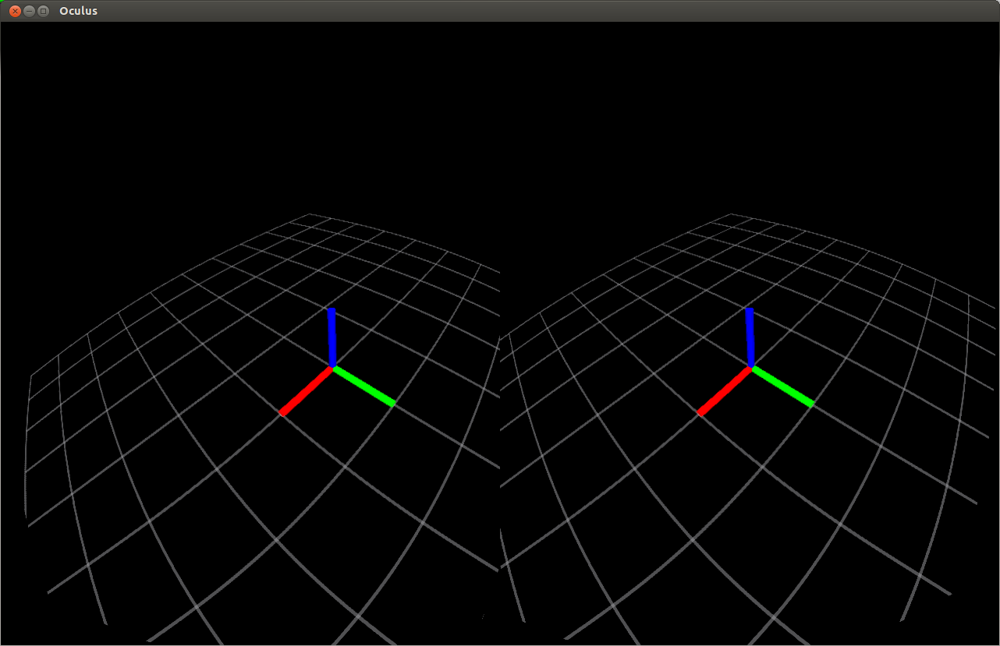

oculus_rviz_plugins
===========

Contains the Oculus Display for RViz. To build it, you will need the [Oculus SDK for Linux 0.2.3](http://developer.oculusvr.com).

This plugin is based on [OgreOculus](https://bitbucket.org/rajetic/ogreoculus) (C++)
and [OsgOculusViewer](https://github.com/bjornblissing/osgoculusviewer) (GLSL shaders).

Usage Instructions
==================

In RViz, add the "OculusDisplay". This will create an additional window with a stereo rendering
of the contents of the main RViz rendering area. Check "Render to Oculus" to 
render in full screen mode on your Oculus headset. It must be set up as secondary screen
for this to work.

By default, the Oculus view will be rendered from the same position as the main RViz camera while following
your head's orientation. Alternatively, you can attach the camera to a tf frame.

This is how the Display should look like in windowed mode:

